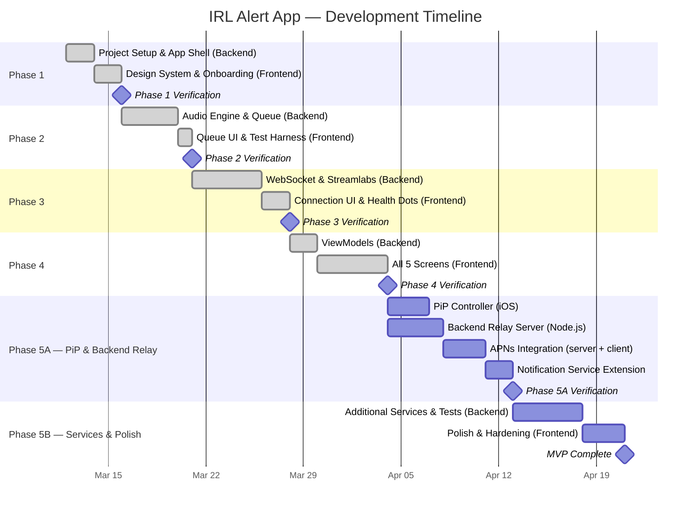

# Enhanced IRL Alert App — Phased Implementation Plan

> [!NOTE]
> Each phase is split into **🔧 Backend** (services, models, data, audio) and **🎨 Frontend** (SwiftUI views, navigation, design). We complete and verify each phase before moving on.

> [!IMPORTANT]
> **Architecture pivot (post-Phase 4):** Viability analysis confirmed that iOS **App Store Guideline 2.5.4** prohibits silent audio loops for background execution. The app now uses a **hybrid PiP + backend relay** architecture. See Phase 5A/5B and the Infrastructure Cost Pathway section below.

---

## Project Timeline

### Timeline Summary

| Phase | Focus | Estimated Duration | Cumulative |
|---|---|---|---|
| **1** ✅ | Project Foundation & App Shell | ~4 days | Week 1 |
| **2** ✅ | Background Audio Engine & Alert Queue | ~5 days | Week 2 |
| **3** ✅ | Networking & Streamlabs Integration | ~7 days | Week 3–4 |
| **4** ✅ | UI Implementation (all screens) | ~7 days | Week 4–5 |
| **5A** | PiP + Backend Relay + APNs | ~10–12 days | Week 6–7 |
| **5B** | Additional Services, Polish & Hardening | ~8 days | Week 8–9 |
| | **Total estimated MVP** | **~41–43 working days (~8–9 weeks)** | |

> [!IMPORTANT]
> **Critical path:** Phase 5A (PiP + Backend Relay) is the new highest-risk phase: it requires building a server-side component, integrating APNs, and implementing the PiP controller — all of which are new to the codebase. Phase 5B depends on 5A being stable.

---

## Design System Reference (from `stitch.zip`)

| Token | Value |
|---|---|
| Primary Color | `#2b7cee` |
| Background (Dark) | `#101822` |
| Surface (Dark) | `#1c2431` / `#161e2b` |
| Background (Light) | `#f6f7f8` |
| Font | Inter (weights 300–700) |
| Corner Radius | 8px default, 16px cards, 24px hero |
| Icon System | Material Symbols Outlined → SF Symbols equivalents |
| Nav Style | iOS tab bar with blur backdrop |

---

## Phase 1 — Project Foundation & App Shell ✅

### 🔧 Backend
1. Initialize **Xcode project** (Swift 6, SwiftUI, iOS 17+ target)
2. Configure **`Info.plist`** — enable `audio` background mode, set bundle ID
3. Set up folder structure: `Models/`, `Views/`, `ViewModels/`, `Services/`, `Utils/`
4. Create **`AppSettings`** model backed by `UserDefaults` (first-launch flag, basic prefs)
5. Build **`NavigationRouter`** (`ObservableObject`) to manage app flow (onboarding → main)
6. ⚠️ **RISK MITIGATION — Register OAuth Apps Early:** Submit OAuth application registrations for **Streamlabs**, **StreamElements**, and **Twitch** developer portals now. Approvals can take days-to-weeks; starting in Phase 1 prevents blocking Phase 3+. Document client IDs, redirect URIs, and approval status in a `CREDENTIALS.md` (gitignored).

### 🎨 Frontend
6. Create **`DesignSystem.swift`** — color tokens, typography, corner-radius constants matching stitch designs
7. Build **`TabBarView`** — bottom tab navigation (Dashboard, Alerts, Testing, Settings) with iOS blur backdrop
8. Create **placeholder views**: `DashboardView`, `EventLogView`, `ConnectionsView`, `AlertTestingView`, `SettingsView`
9. Implement **`OnboardingView`** — multi-step paging, permission prompts, "Skip", progress dots

### ✅ Verify
App launches → onboarding on first run → navigates to tab bar with placeholder screens.

---

## Phase 2 — Background Audio Engine & Alert Queue ✅

### 🔧 Backend
1. **`AudioSessionManager`** — configure `AVAudioSession` (`.playback`, `.mixWithOthers`), handle interruptions & route changes
2. ~~**`SilentAudioPlayer`** — loop a silent audio track to prevent iOS process suspension~~ ⚠️ **DEPRECATED:** Silent audio loops violate App Store Guideline 2.5.4. Background execution is now handled via PiP (Phase 5A). `SilentAudioPlayer` is retained for TestFlight/development use only and **must not ship** to the App Store.
3. **`AudioPlaybackService`** — download, cache, and play alert sounds (`AVAudioPlayer`) with completion callback
4. **`TTSManager`** — wrap `AVSpeechSynthesizer`, configurable voice/rate/volume, completion callback
5. **`AlertQueueManager`** — FIFO queue processing `AlertEvent` items sequentially:
   - Sound → TTS → inter-alert delay (default 1s)
   - Overflow threshold (default 20): summarize/skip when exceeded
   - Expose observable `queueCount`
6. **`MediaCacheManager`** — download remote sound files to disk, serve from cache on repeat

### 🎨 Frontend
7. Add **queue status indicator** component (pending count + pulsing dot) — reusable across Event Log and Dashboard
8. Wire **Alert Testing placeholder** to fire mock `AlertEvent`s through the queue

### ✅ Verify
Fire a mock alert → hear audio + TTS. Minimize app → fire another → hear it play over Spotify/Music.

---

## Phase 3 — Networking & Service Integration ✅

### 🔧 Backend
1. **`AlertEvent` model** — unified struct: `id`, `type` (donation/follow/sub/bits/host/raid), `username`, `message`, `amount`, `soundURL`, `timestamp`, `source`
2. **`AlertServiceProtocol`** — contract: `connect()`, `disconnect()`, `onAlert` callback, `connectionState` publisher
3. **`WebSocketClient`** — generic client via `URLSessionWebSocketTask`:
   - Auto-reconnect with exponential backoff (1s → 2s → 4s → … → 30s)
   - Ping/pong heartbeat
   - State: `.connected`, `.connecting`, `.disconnected`, `.reconnecting`
4. **`StreamlabsService`** (first integration) — implements `AlertServiceProtocol`:
   - **Browser Source URL mode:** parse overlay URL → extract socket token → native WebSocket
   - **OAuth mode:** `ASWebAuthenticationSession` → obtain token → connect
   - Parse JSON payloads into `AlertEvent`
5. ⚠️ **RISK MITIGATION — Browser Source URL Token Resilience:** Build the URL parser with a **versioned regex strategy** — extract the socket token using multiple known Streamlabs URL patterns. Add a unit test suite with 5+ real-world URL formats. If token extraction fails at runtime, surface a clear user error ("URL format not recognized") and prompt the user to fall back to OAuth sign-in instead. Log failed URL patterns for future pattern updates.
6. **`ConnectionManager`** — orchestrates multiple service instances, exposes per-service health status
7. **`EventStore`** — persist recent events locally (SwiftData or JSON file, cap ~500)
8. **Disconnect notification** — if connection drops >30s, fire `UNUserNotification`

### 🎨 Frontend
8. Build **`ConnectionsView`** input flow — text field for Browser Source URL, OAuth sign-in button
9. Add **connection health dots** (green/red) to Dashboard service connectivity grid

### ✅ Verify
Paste a Streamlabs URL → connect → receive a real donation alert. Kill Wi-Fi → see reconnection → resume.

---

## Phase 4 — UI Implementation ✅

### 🔧 Backend
1. Create **ViewModels** for each screen binding to real services (`DashboardVM`, `EventLogVM`, `ConnectionsVM`, `SettingsVM`, `AlertTestingVM`)

### 🎨 Frontend
2. **`DashboardView`** — hero status circle, service grid, metrics cards. Ref: `stitch/refined_dashboard/screen.png`
3. **`EventLogView`** — queue status, filter tabs, color-coded alert cards. Ref: `stitch/refined_event_log/screen.png`
4. **`ConnectionsView`** — sync banner, service grid, Quick Connect. Ref: `stitch/refined_connections/screen.png`
5. **`AlertTestingView`** — readiness gauge, alert type grid, deploy CTA. Ref: `stitch/refined_alert_testing/screen.png`
6. **`SettingsView`** — volume sliders, TTS voice, filters, threshold. Ref: `stitch/refined_settings/screen.png`

### ✅ Verify
Visual comparison of each screen against `screen.png` references. All screens show live data.

---

## Phase 5A — PiP Controller & Backend Relay (NEW)

> [!IMPORTANT]
> This phase implements the **App Store-compliant background execution strategy** described in PRD §5.2. It replaces the `SilentAudioPlayer` approach with a hybrid PiP + server push architecture.

### 🔧 Backend (iOS)
1. **`PiPManager`** — manage `AVPictureInPictureController` lifecycle:
   - Start PiP automatically when app enters background (if user has enabled it)
   - Render a lightweight video layer showing: last alert info, connection status, queue count
   - Handle PiP restore (user taps to return to full app)
   - Ensure WebSocket connections remain alive while PiP is active
2. **`PushNotificationManager`** — register for APNs, store device token, handle incoming push payloads:
   - Parse alert payloads from push notifications
   - Route to `AlertQueueManager` for playback
3. **`NotificationServiceExtension`** [NEW TARGET] — Xcode Notification Service Extension:
   - Intercept incoming alert pushes before display
   - Attach custom alert sound (download if needed within ~30s window)
   - Modify notification content with alert details
4. **Modify `ConnectionManager`** — add awareness of PiP state:
   - When PiP active: use direct WebSocket (Layer 2)
   - When PiP dismissed: signal backend relay to take over (Layer 3)
   - Send device token to relay server on registration

### 🔧 Backend (Server — Node.js)
5. **`relay-server/`** [NEW CODEBASE] — lightweight Node.js relay server:
   - **User registration endpoint** — iOS app sends: device APNs token + service credentials (socket token / OAuth token)
   - **Per-user WebSocket connections** — server maintains persistent connections to Streamlabs/Twitch/SE/SoundAlerts on behalf of each user
   - **Alert forwarding** — on alert event, send high-priority APNs payload to user's device via `@parse/node-apn` or `apns2`
   - **Health monitoring** — reconnect dropped service connections with exponential backoff
   - **Activation/deactivation** — iOS app signals when it has a direct connection (PiP/foreground) → server pauses push forwarding to avoid duplicates
   - **Deployment:** Fly.io (see Infrastructure Cost Pathway below)

### 🎨 Frontend
6. **PiP status view** — minimal SwiftUI view rendered into the PiP video layer (alert name, connection dot, queue count)
7. **Settings integration** — add "Enable PiP on Background" toggle to `SettingsView`
8. **Push notification opt-in** — onboarding step or settings toggle for push-based fallback alerts

### ✅ Verify
1. App in foreground → receive alert via direct WebSocket → audio plays ✅
2. App backgrounded with PiP → PiP window visible → alert arrives → audio plays ✅
3. PiP dismissed → backend relay active → alert arrives as push notification → sound plays ✅
4. App terminated → push notification with alert sound ✅
5. Return to foreground → relay deactivates → direct WebSocket resumes ✅

---

## Phase 5B — Additional Services, Polish & Hardening

### 🔧 Backend
1. **`StreamElementsService`** — second integration via `AlertServiceProtocol`
2. **`TwitchNativeService`** — Twitch EventSub WebSocket for native alerts
3. **`SoundAlertsService`** — SoundAlerts integration
4. **Offline queue recovery** — fetch missed events on reconnection (if service API supports)
5. **Unit tests** for `AlertQueueManager`, `WebSocketClient` reconnect logic, `EventStore`
6. **Server-side service connectors** — add StreamElements, Twitch, SoundAlerts to the relay server

### 🎨 Frontend
7. **Disconnect notification settings** — configurable timeout in Settings
8. Final **polish pass** — animations, transitions, haptics, dark/light mode parity
9. **UI Polish — Service Logos**: Replace SF Symbol placeholders for Twitch, StreamElements, Streamlabs, and SoundAlerts with their actual brand logos
10. Update `ConnectionsView` to show all supported services

### ✅ Verify
Unit tests pass. Multi-service connection. 30-minute background soak test with PiP. Push notification fallback test.

---

## Infrastructure Cost Pathway

### Fixed Costs

| Item | Cost | Frequency |
|---|---|---|
| Apple Developer Program | **$99** | Per year |
| APNs (Push Notifications) | **$0** | Free from Apple |
| Domain name (optional, for relay API) | ~$12 | Per year |
| **Fixed total** | **~$111/year** (~$9.25/mo) | |

### Relay Server Hosting — Recommended: Fly.io

| Scale | Fly.io Spec | Server Cost/mo | Notes |
|---|---|---|---|
| **Launch (1–50 users)** | shared-cpu-1x, 256 MB | **~$2–3** | No per-connection charge. Billed per second |
| **Growth (50–500 users)** | shared-cpu-1x, 512 MB | **~$4–7** | Bandwidth ~$0.02/GB |
| **Scale (500–5,000 users)** | 2× shared-cpu-2x, 1 GB each | **~$15–30** | Horizontal scaling |

### Total Monthly Cost

| Scale | Server | Apple (amortized) | **Total/month** |
|---|---|---|---|
| **Launch** | $2–3 | $8.25 | **~$10–12** |
| **Growth** | $4–7 | $8.25 | **~$13–16** |
| **Scale** | $15–30 | $8.25 | **~$24–39** |

> [!TIP]
> At launch scale, total infrastructure cost is **~$10–12/month** (~$130/year). This is comparable to a single streaming subscription. Costs scale linearly with user count and remain modest even at thousands of concurrent users.

### Alternative Providers (for reference)

| Provider | Launch Cost | Pros | Cons |
|---|---|---|---|
| **Railway** | ~$5/mo (Hobby) | Simple deploy, $5 credit included | Higher base cost |
| **Render** | ~$7/mo (Starter) | Predictable pricing, native WebSocket support | Free tier spins down (bad for WebSockets) |
| **Self-hosted VPS** | ~$4–6/mo (Hetzner/DigitalOcean) | Full control | Manual ops, no auto-scaling |

---

## Summary Matrix

| Phase | Backend Tasks | Frontend Tasks | Key Risk |
|---|---|---|---|
| 1 ✅ | Project setup, data models, router | Design system, tab bar, onboarding | None (foundation) |
| 2 ✅ | Audio session, TTS, queue, caching | Queue indicator, test harness | ~~iOS background suspension~~ Resolved by PiP |
| 3 ✅ | WebSocket, Streamlabs, event store | Connection input UI, health dots | Service API changes |
| 4 ✅ | ViewModels | All 5 main screens | Design fidelity |
| 5A | PiP controller, relay server, APNs | PiP view, push settings | PiP content approval, APNs integration |
| 5B | 3 more services, offline recovery, tests | Polish, logos, settings expansion | API coverage |

---

## Risk Mitigation Tracker

| Risk | Phase | Mitigation Action |
|---|---|---|
| OAuth app registration lead time | **1** (task 6) | Register apps on all three platforms immediately; track approval status |
| ~~iOS background process suspension~~ | ~~**2** (task 7)~~ | ~~Physical device soak test~~ → **Resolved:** PiP (Phase 5A) replaces silent audio loop |
| Browser Source URL token extraction fragility | **3** (task 5) | Versioned regex parser, unit test suite, graceful OAuth fallback |
| **App Store Guideline 2.5.4 (silent audio)** | **5A** | `SilentAudioPlayer` deprecated. PiP + APNs fallback is App Store compliant |
| **PiP content review** | **5A** (task 1) | PiP renders meaningful content (alert info, status). Not a blank/fake video |
| **Relay server availability** | **5A** (task 5) | Fly.io auto-restart on crash. Health monitoring with exponential backoff reconnection |
| **APNs delivery latency** | **5A** (task 3) | APNs is fallback only — primary path (PiP) has zero additional latency |
