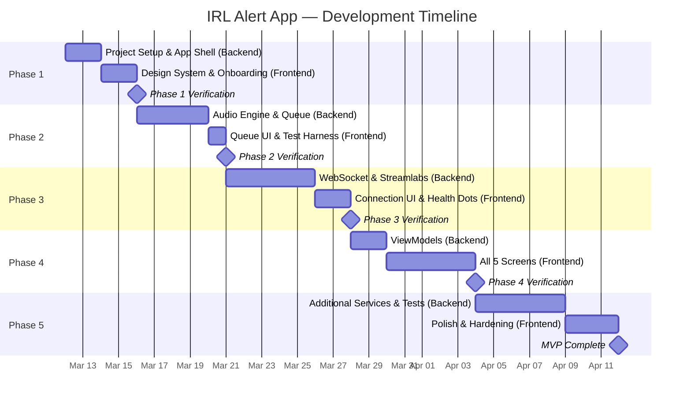

# Enhanced IRL Alert App — Phased Implementation Plan

> [!NOTE]
> Each phase is split into **🔧 Backend** (services, models, data, audio) and **🎨 Frontend** (SwiftUI views, navigation, design). We complete and verify each phase before moving on.

---

## Project Timeline

### Timeline Summary

| Phase | Focus | Estimated Duration | Cumulative |
|---|---|---|---|
| **1** | Project Foundation & App Shell | ~4 days | Week 1 |
| **2** | Background Audio Engine & Alert Queue | ~5 days | Week 2 |
| **3** | Networking & Streamlabs Integration | ~7 days | Week 3–4 |
| **4** | UI Implementation (all screens) | ~7 days | Week 4–5 |
| **5** | Additional Services, Polish & Hardening | ~8 days | Week 6–7 |
| | **Total estimated MVP** | **~31 working days (~6–7 weeks)** | |

> [!IMPORTANT]
> **Critical path:** Phase 2 (background audio) and Phase 3 (WebSocket + Streamlabs) carry the highest technical risk. If iOS background execution requires workarounds beyond the silent audio loop, Phase 2 may extend. Phase 3 timelines depend on Streamlabs API stability and documentation.

---

## Design System Reference (from `stitch.zip`)

| Token | Value |
|---|---|
| Primary Color | `#2b7cee` |
| Background (Dark) | `#101822` |
| Surface (Dark) | `#1c2431` / `#161e2b` |
| Background (Light) | `#f6f7f8` |
| Font | Inter (weights 300–700) |
| Corner Radius | 8px default, 16px cards, 24px hero |
| Icon System | Material Symbols Outlined → SF Symbols equivalents |
| Nav Style | iOS tab bar with blur backdrop |

---

## Phase 1 — Project Foundation & App Shell

### 🔧 Backend
1. Initialize **Xcode project** (Swift 6, SwiftUI, iOS 17+ target)
2. Configure **`Info.plist`** — enable `audio` background mode, set bundle ID
3. Set up folder structure: `Models/`, `Views/`, `ViewModels/`, `Services/`, `Utils/`
4. Create **`AppSettings`** model backed by `UserDefaults` (first-launch flag, basic prefs)
5. Build **`NavigationRouter`** (`ObservableObject`) to manage app flow (onboarding → main)
6. ⚠️ **RISK MITIGATION — Register OAuth Apps Early:** Submit OAuth application registrations for **Streamlabs**, **StreamElements**, and **Twitch** developer portals now. Approvals can take days-to-weeks; starting in Phase 1 prevents blocking Phase 3+. Document client IDs, redirect URIs, and approval status in a `CREDENTIALS.md` (gitignored).

### 🎨 Frontend
6. Create **`DesignSystem.swift`** — color tokens, typography, corner-radius constants matching stitch designs
7. Build **`TabBarView`** — bottom tab navigation (Dashboard, Alerts, Testing, Settings) with iOS blur backdrop
8. Create **placeholder views**: `DashboardView`, `EventLogView`, `ConnectionsView`, `AlertTestingView`, `SettingsView`
9. Implement **`OnboardingView`** — multi-step paging, permission prompts, "Skip", progress dots

### ✅ Verify
App launches → onboarding on first run → navigates to tab bar with placeholder screens.

---

## Phase 2 — Background Audio Engine & Alert Queue

### 🔧 Backend
1. **`AudioSessionManager`** — configure `AVAudioSession` (`.playback`, `.mixWithOthers`), handle interruptions & route changes
2. **`SilentAudioPlayer`** — loop a silent audio track to prevent iOS process suspension
3. **`AudioPlaybackService`** — download, cache, and play alert sounds (`AVAudioPlayer`) with completion callback
4. **`TTSManager`** — wrap `AVSpeechSynthesizer`, configurable voice/rate/volume, completion callback
5. **`AlertQueueManager`** — FIFO queue processing `AlertEvent` items sequentially:
   - Sound → TTS → inter-alert delay (default 1s)
   - Overflow threshold (default 20): summarize/skip when exceeded
   - Expose observable `queueCount`
6. **`MediaCacheManager`** — download remote sound files to disk, serve from cache on repeat
7. ⚠️ **RISK MITIGATION — Physical Device Background Soak Test:** Before moving to Phase 3, deploy to a **physical iPhone** and run a 15-minute background soak test: play alert → minimize app → wait → play another alert. Validate that the silent audio loop keeps the process alive across iOS versions 17+. If Apple's background policies reject the silent loop, investigate fallback strategies (`BGProcessingTask`, VOIP push notifications, or location background mode).

### 🎨 Frontend
7. Add **queue status indicator** component (pending count + pulsing dot) — reusable across Event Log and Dashboard
8. Wire **Alert Testing placeholder** to fire mock `AlertEvent`s through the queue

### ✅ Verify
Fire a mock alert → hear audio + TTS. Minimize app → fire another → hear it play over Spotify/Music.

---

## Phase 3 — Networking & Service Integration

### 🔧 Backend
1. **`AlertEvent` model** — unified struct: `id`, `type` (donation/follow/sub/bits/host/raid), `username`, `message`, `amount`, `soundURL`, `timestamp`, `source`
2. **`AlertServiceProtocol`** — contract: `connect()`, `disconnect()`, `onAlert` callback, `connectionState` publisher
3. **`WebSocketClient`** — generic client via `URLSessionWebSocketTask`:
   - Auto-reconnect with exponential backoff (1s → 2s → 4s → … → 30s)
   - Ping/pong heartbeat
   - State: `.connected`, `.connecting`, `.disconnected`, `.reconnecting`
4. **`StreamlabsService`** (first integration) — implements `AlertServiceProtocol`:
   - **Browser Source URL mode:** parse overlay URL → extract socket token → native WebSocket
   - **OAuth mode:** `ASWebAuthenticationSession` → obtain token → connect
   - Parse JSON payloads into `AlertEvent`
5. ⚠️ **RISK MITIGATION — Browser Source URL Token Resilience:** Build the URL parser with a **versioned regex strategy** — extract the socket token using multiple known Streamlabs URL patterns. Add a unit test suite with 5+ real-world URL formats. If token extraction fails at runtime, surface a clear user error ("URL format not recognized") and prompt the user to fall back to OAuth sign-in instead. Log failed URL patterns for future pattern updates.
6. **`ConnectionManager`** — orchestrates multiple service instances, exposes per-service health status
7. **`EventStore`** — persist recent events locally (SwiftData or JSON file, cap ~500)
8. **Disconnect notification** — if connection drops >30s, fire `UNUserNotification`

### 🎨 Frontend
8. Build **`ConnectionsView`** input flow — text field for Browser Source URL, OAuth sign-in button
9. Add **connection health dots** (green/red) to Dashboard service connectivity grid

### ✅ Verify
Paste a Streamlabs URL → connect → receive a real donation alert. Kill Wi-Fi → see reconnection → resume.

---

## Phase 4 — UI Implementation

### 🔧 Backend
1. Create **ViewModels** for each screen binding to real services (`DashboardVM`, `EventLogVM`, `ConnectionsVM`, `SettingsVM`, `AlertTestingVM`)

### 🎨 Frontend
2. **`DashboardView`** — hero status circle, service grid, metrics cards. Ref: `stitch/refined_dashboard/screen.png`
3. **`EventLogView`** — queue status, filter tabs, color-coded alert cards. Ref: `stitch/refined_event_log/screen.png`
4. **`ConnectionsView`** — sync banner, service grid, Quick Connect. Ref: `stitch/refined_connections/screen.png`
5. **`AlertTestingView`** — readiness gauge, alert type grid, deploy CTA. Ref: `stitch/refined_alert_testing/screen.png`
6. **`SettingsView`** — volume sliders, TTS voice, filters, threshold. Ref: `stitch/refined_settings/screen.png`

### ✅ Verify
Visual comparison of each screen against `screen.png` references. All screens show live data.

---

## Phase 5 — Additional Services, Polish & Hardening

### 🔧 Backend
1. **`StreamElementsService`** — second integration via `AlertServiceProtocol`
2. **`TwitchNativeService`** — Twitch EventSub WebSocket for native alerts
3. **`SoundAlertsService`** — SoundAlerts integration
4. **Offline queue recovery** — fetch missed events on reconnection (if service API supports)
5. **Unit tests** for `AlertQueueManager`, `WebSocketClient` reconnect logic, `EventStore`

### 🎨 Frontend
6. **Disconnect notification settings** — configurable timeout in Settings
7. Final **polish pass** — animations, transitions, haptics, dark/light mode parity
8. Update `ConnectionsView` to show all supported services

### ✅ Verify
Unit tests pass. Multi-service connection. 30-minute background soak test.

---

## Summary Matrix

| Phase | Backend Tasks | Frontend Tasks | Key Risk |
|---|---|---|---|
| 1 | Project setup, data models, router | Design system, tab bar, onboarding | None (foundation) |
| 2 | Audio session, TTS, queue, caching | Queue indicator, test harness | iOS background suspension |
| 3 | WebSocket, Streamlabs, event store | Connection input UI, health dots | Service API changes |
| 4 | ViewModels | All 5 main screens | Design fidelity |
| 5 | 3 more services, offline recovery, tests | Polish, settings expansion | API coverage |

---

## Risk Mitigation Tracker

All key risks are embedded as ⚠️ tasks in their respective phases. Summary:

| Risk | Phase | Mitigation Action |
|---|---|---|
| OAuth app registration lead time | **1** (task 6) | Register apps on all three platforms immediately; track approval status |
| iOS background process suspension | **2** (task 7) | Physical device soak test before Phase 3; fallback strategies identified |
| Browser Source URL token extraction fragility | **3** (task 5) | Versioned regex parser, unit test suite, graceful OAuth fallback |
